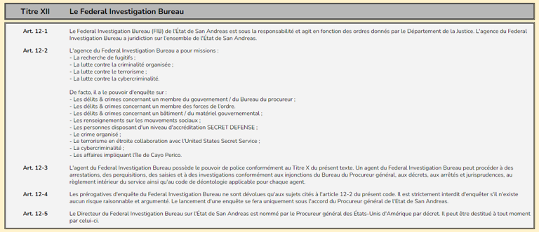

# 🏤 Legal Right

En tant qu’agent du United States Marshals Service, votre juridiction est applicable sur l'ensemble du territoire des États-Unis d'Amérique, y compris San Andreas.

En votre qualité d'agent fédéral, vous possédez le pouvoir de police. Vous êtes habilité à limiter la liberté des individus et à influencer leur comportement lorsqu'il y va de la « sûreté, de la santé, de la morale et du bien-être général ». Ce pouvoir se prévaut d'une interprétation du Xème amendement de la constitution des Etats Unis.

Dans le cadre d'une procédure, un agent du United States Marshals Service peut procéder à des arrestations, des perquisitions et des investigations dans le cadre d'opération fédérale du département.

Lorsque vous êtes en service et dans le cadre de réalisation d'une mission fédéral (en intervention), vous êtes prioritaires sur les services de police locaux et étatiques. Un officier de police peut vous contrôler lorsque que vous êtes en service. Si cela venait à arriver, veillez à suivre la procédure suivante:

* Obtempérez jusqu'à se que l'agent se présente et annonce le contrôle.
* Présentez votre badge de service et annoncez votre nom de famille.
* Ne présentez aucun document d'identité ni du véhicule de service.

Si l'officier insiste et ne vous laisse pas repartir, informez-le que vous êtes en mission fédérale et que son action entrave une opération fédérale conformément à l'article 441-11 du code pénal de l'Etat de San Andreas, et qu'il doit vous laisser circuler.

Attention ! Si l'agent refuse toujours de vous laisser partir, contactez immédiatement votre supérieur qui contactera la supervision de l'officier. Vous êtes en droit de garder le silence jusqu'à l'arrivée d'un supérieur hiérarchique sur place.

Extrait du Code Juridictionnel du State Code de San Andreas - Titre XII: Le Federal Investigation Bureau HORS SERVICE

Même en dehors de vos heures de service, vous êtes toujours considéré comme un agent fédéral. Ce statut ne vous accorde pas de passe-droit et vous devez respecter la loi et vous y soumettre comme tout citoyen.

Si vous commettez une infraction, vous devrez en supporter les conséquences. Si vous commettez un délit ou un crime, l'Inspection Division se saisira immédiatement de l'affaire pour déterminer si l'infraction est liée directement ou indirectement à l'agence. Vous risquez alors de perdre votre poste au sein de l'agence.

<figure><figcaption></figcaption></figure>
