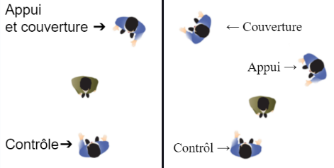

# 👮 L'essentiel

#### Placement

Votre placement doit, en toute circonstance, répondre à une logique dite “sécuritaire”. En effet.



* Gardez vos distances (1m50)
* Faites-en sorte de ne jamais avoir une personne dans votre dos
* Gardez un visuel constant sur ses mains
* Ne vous mettez pas proche des lieux inflammables
* Ne restez pas proche d’un trafic rapide

<figure><figcaption></figcaption></figure>



* Ne vous mettez pas contre la fenêtre de la personne, restez en arrière
* Si plusieurs personnes dans le véhicule, appelez du renfort, faites en sorte de ne pas être seul
* Ne passez jamais devant ou derrière le véhicule contrôlé (risque de percussion), ni entre votre véhicule et celui du suspect



#### Le Prime Intervenant

Le primo intervenant est la première unité à accéder à une intervention. Le primo intervenant a la charge de :

* Rendre compte à l’oral aux collègues / autres services rejoignant l’intervention
* Coordonner l’intervention en l’absence d’un superviseur / gradé
* Rendre compte à la suite de l’intervention

#### Analyse de la situation

Avant d’entreprendre une quelconque action, vous devez impérativement analyser la situation. Cela se fait la plupart du temps inconsciemment, mais veillez à toujours répondre à ces questions :

* Où ?
* Quoi ?
* Combien de personnes ?
* Risques ?

#### Réflexion sur la conduite à tenir

La réflexion correspond ni plus ni moins à la façon dont vous allez utiliser les données de l’analyse, pour répondre à ces questions :

* Êtes-vous en danger ?
* Êtes-vous en position de force ou non ?
* Avez-vous besoin de soutien ?
* Devez-vous faire appel à d’autres services (SAMS etc…)
* Et d’autres questions en fonction de l’intervention

#### Action post-analyse

Après l’analyse et la réflexion, vous devez entreprendre l’action. Le principe est toujours le même : Se placer en sécurité, prendre le plus d’informations possibles pour réagir en fonction des données que vous possédez. Le questionnement est constant, le principe “Analyse, réflexion, action” se répète tout au long de vos interventions.

Fait partie de l’action la communication radio également, qui doit être établie pour chaque intervention. Communiquer est primordial. Exemple de communication :

* Type de crime _utiliser les termes_ si possibles pour plus de fluidité et d’efficacité ;
* S’est produit il y a – Minutes ;
* Emplacement ;
* Véhicule utilisé (ou laissé à pied) ;
* Direction prise – _points cardinaux | point d’intérêt ou rue si possible_ ;
* Informations sur le(s) suspect(s) – Sexe, nom(s)/prénom(s), âge, taille, etc.
* Caractéristiques exceptionnelles ;
* Arme ;

#### Procédure post-intervention

Pour conclure une intervention, vous devez rendre compte, via rapport écrit ou oral en fonction de la demande de votre superviseur.

#### Exemple complet

Vous êtes appelé sur un vol dans un magasin. Arrivé sur place, vous découvrez 4 hommes masqués à l’intérieur du magasin. Vous êtes seul. Des renforts sont disponibles.

Marche à suivre :

<table data-full-width="false"><thead><tr><th width="329" valign="top">Analyse</th><th width="238" valign="top">Réflexion</th><th width="287" valign="top">Action post-analyse</th></tr></thead><tbody><tr><td valign="top"><strong>Où ?</strong> Dans un magasin d’habits <strong>Quoi ?</strong> Un vol en bande organisée <strong>Combien de personnes ?</strong> 4, masquées <strong>Risques ?</strong> Risque d’agression sur ma personne si les personnes sortent et sont armées, risque de prise en otage du personnel du magasin, risque de fuite des individus s’ils sortent et se séparent pour partir.</td><td valign="top"><strong>Vous êtes en danger ?</strong> Potentiellement, ainsi que les vendeurs du magasin et les civils autour. <strong>Vous êtes en position de force ou non ?</strong> Non, ils sont 4, même si je suis armé, je ne peux pas faire face seul. <strong>Vous avez besoin de soutien ?</strong> Oui <strong>Vous devez faire appel à d’autres services (SAMS etc...) ?</strong> Non</td><td valign="top">
Pour le moment, je reste discret, je poursuis mon analyse à distance tout en appelant mes collègues en renfort. Une fois le renfort sur place, j’entreprends l’intervention. Attention, l’analyse continue et la réflexion aussi. Il faut savoir comment je rentre dans le magasin, comment je peux prévoir la fuite des individus, quel danger réel peuvent-ils représenter, quel contact je vais établir.

Partons du principe qu’aucun individu n’est armé

J’établis un contact, 2 collègues sont en attente dehors, j’ai un collègue avec moi pour progresser, je rentre sans arme mais prêt à dégainer, en dissuasion. Je prends contact avec les individus par voie orale et j’établis un bilan rapide de la situation pour agir en amont.
</td></tr></tbody></table>

<mark style="color:red;">**Attention :**</mark> <mark style="color:red;">Une des bases est également de toujours avoir un collègue en soutien, progresser en binôme dans des situations dangereuses ou potentiellement dangereuses.</mark>

#### Prise de notes pendant l'intervention

Lors d’une intervention, vous serez amené à rencontrer un ou plusieurs témoin(s). Il est important de les écouter de ne pas systématiquement les rediriger vers le pdp.

Posez-leur alors des questions de manière à déterminer les éléments suivants et à repartir avec ces informations :

* **QUI** a été le témoin ou l’auteur de l’acte ?
* **QUE** s’est-il passé exactement ?
* **QUAND** l’événement a-t-il eu lieu (date, heure, circonstances) ?
* **OÙ** l’événement a-t-il eu lieu (décrivez-le en détail) ?
* **POURQUOI** l’événement a-t-il eu lieu (motif) ?
* **COMMENT** cela s’est-il passé
